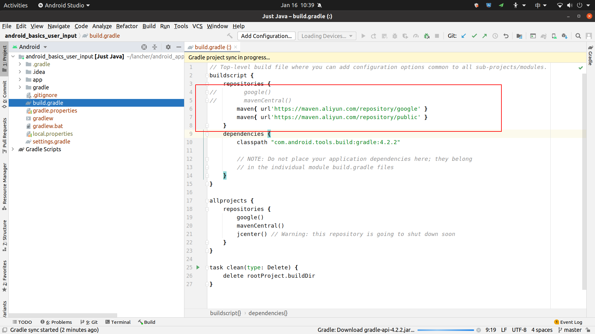

[TOC]

# Android app development


## I. Linux install Android Studio

### 1. Install Android Studio

To install Android Studio on Linux, proceed as follows:

1. Unpack the .zip file you downloaded to an appropriate location for your applications, such as within

   ```
   /usr/local/
   ```

   for your user profile, or

   ```
   /opt/
   ```

   for shared users.

   If you're using a 64-bit version of Linux, make sure you first install the [required libraries for 64-bit machines](https://developer.android.com/studio/install#64bit-libs).

2. To launch Android Studio, open a terminal, navigate to the `android-studio/bin/` directory, and execute `studio.sh`.

3. Select whether you want to import previous Android Studio settings or not, then click **OK**.

4. The Android Studio Setup Wizard guides you through the rest of the setup, which includes downloading Android SDK components that are required for development.

**Tip:** To make Android Studio available in your list of applications, select **Tools > Create Desktop Entry** from the Android Studio menu bar.

#### Required libraries for 64-bit machines

If you are running a 64-bit version of Ubuntu, you need to install some 32-bit libraries with the following command:

```
sudo apt-get install libc6:i386 libncurses5:i386 libstdc++6:i386 lib32z1 libbz2-1.0:i386
```

If you are running 64-bit Fedora, the command is:

```
sudo yum install zlib.i686 ncurses-libs.i686 bzip2-libs.i686
```


### 2. Configure VM acceleration on Linux

Linux-based systems support VM acceleration through the [KVM software package.](https://www.linux-kvm.org/page/Main_Page) Follow the instructions for installing KVM on your Linux system, and verify that KVM is enabled. For Ubuntu systems, see [Ubuntu KVM Installation](https://help.ubuntu.com/community/KVM/Installation).

#### Requirements

Running KVM requires specific user permissions. Make sure that you have sufficient permissions as specified in the KVM installation instructions.

To use VM acceleration on Linux, your computer must also meet these requirements:

- For Intel processors: Support for Virtualization Technology (VT-x), Intel EM64T (Intel 64) features, and Execute Disable (XD) Bit functionality enabled.
- For AMD processors: Support for AMD Virtualization (AMD-V).

#### Check whether KVM is currently installed on Linux

You can use the emulator [`-accel-check`](https://developer.android.com/studio/run/emulator-acceleration?utm_source=android-studio#accel-check) command-line option to check whether you have KVM installed. Alternatively, you can install the `cpu-checker` package containing the `kvm-ok` command.

The following example shows how to use the `kvm-ok` command:

```
$ sudo apt-get install cpu-checker
$ egrep -c '(vmx|svm)' /proc/cpuinfo
12
$ kvm-ok
INFO: /dev/kvm exists
KVM acceleration can be used
```

#### Install KVM on Linux

Use the following command to install KVM:

```
sudo apt-get install qemu-kvm libvirt-bin ubuntu-vm-builder bridge-utils ia32-libs-multiarch
```

#### 查看虚拟机运行状态

```
virsh list --all
```


## II. Grable同步慢的问题

### 1. Edit the root build.gradle file

 (adding a new line to file will also do).



```java
buildscript {
    repositories {
//        google()
//        mavenCentral()
        maven{ url'https://maven.aliyun.com/repository/google' }
        maven{ url'https://maven.aliyun.com/repository/public' }
    }
```

### 2. Save the file.

### 3. Restart the IDE 

(File->Invalid Cache/Restart->Just Restart). Gradle Sync in progress notification should go away.


### 4.下载虚拟device没反应，手动下载

```
https://dl.google.com/android/repository/sys-img/google_apis/x86-30_r10.zip

C:\Users\BAILONG\AppData\Local\Android\Sdk\system-images\android-30\google_apis\x86
```


## III. Android Studio快捷键

删除当前行：ctrl + y (Ubuntu)，command + delete (Mac)